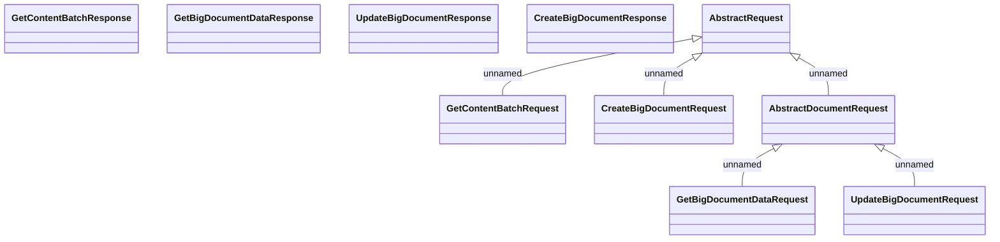

# Big

- **Diagram Type**: Logical
- **Package**: HomerSelect/BSL/Analysis Model/_Interface/Consumed services/Document Management System/Big
- **Diagram ID**: 77489
- **Elements**: 10
- **Connectors**: 5

