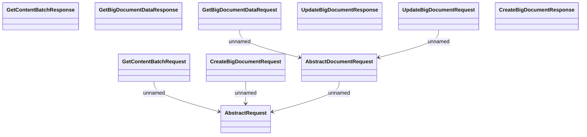

# Big

```mermaid
classDiagram
    class GetContentBatchResponse["GetContentBatchResponse"]
    class GetContentBatchRequest["GetContentBatchRequest"]
    class GetBigDocumentDataResponse["GetBigDocumentDataResponse"]
    class GetBigDocumentDataRequest["GetBigDocumentDataRequest"]
    class UpdateBigDocumentResponse["UpdateBigDocumentResponse"]
    class UpdateBigDocumentRequest["UpdateBigDocumentRequest"]
    class CreateBigDocumentRequest["CreateBigDocumentRequest"]
    class CreateBigDocumentResponse["CreateBigDocumentResponse"]
    class AbstractDocumentRequest["AbstractDocumentRequest"]
    class AbstractRequest["AbstractRequest"]
    GetContentBatchRequest --> AbstractRequest : unnamed
    CreateBigDocumentRequest --> AbstractRequest : unnamed
    AbstractDocumentRequest --> AbstractRequest : unnamed
    GetBigDocumentDataRequest --> AbstractDocumentRequest : unnamed
    UpdateBigDocumentRequest --> AbstractDocumentRequest : unnamed
```
