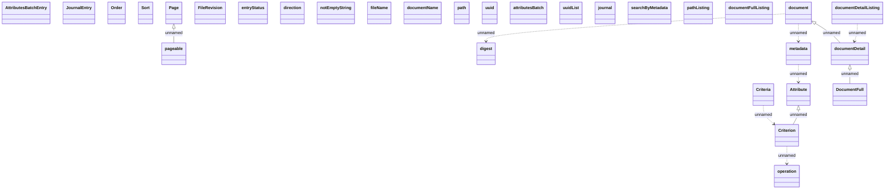

# Core

- **Diagram Type**: Logical
- **Package**: HomerSelect/BSL/Analysis Model/_Interface/Consumed services/Document Management System/Core
- **Diagram ID**: 85262
- **Elements**: 30
- **Connectors**: 10

