# Standard

- **Diagram Type**: Logical
- **Package**: HomerSelect/BSL/Analysis Model/_Interface/Consumed services/Document Management System/Standard
- **Diagram ID**: 77487
- **Elements**: 37
- **Connectors**: 19

```mermaid
classDiagram
    class SetBatchMetadataResponse["SetBatchMetadataResponse"]
    class SetBatchMetadataRequest["SetBatchMetadataRequest"]
    class IsDocumentDataExistByDigestResponse["IsDocumentDataExistByDigestResponse"]
    class IsDocumentDataExistByDigestRequest["IsDocumentDataExistByDigestRequest"]
    class GetDocumentDataResponse["GetDocumentDataResponse"]
    class GetDocumentDataRequest["GetDocumentDataRequest"]
    class ListDirectPathsResponse["ListDirectPathsResponse"]
    class ListDirectPathsRequest["ListDirectPathsRequest"]
    class ListPathsResponse["ListPathsResponse"]
    class ListPathsRequest["ListPathsRequest"]
    class ListDocumentsFullResponse["ListDocumentsFullResponse"]
    class ListDocumentsFullRequest["ListDocumentsFullRequest"]
    class ListDocumentsResponse["ListDocumentsResponse"]
    class ListDocumentsRequest["ListDocumentsRequest"]
    class GetDocumentFullListResponse["GetDocumentFullListResponse"]
    class GetDocumentFullListRequest["GetDocumentFullListRequest"]
    class GetDocumentListResponse["GetDocumentListResponse"]
    class GetDocumentListRequest["GetDocumentListRequest"]
    class GetDocumentFullResponse["GetDocumentFullResponse"]
    class GetDocumentFullRequest["GetDocumentFullRequest"]
    class MoveDocumentResponse["MoveDocumentResponse"]
    class MoveDocumentRequest["MoveDocumentRequest"]
    class DeleteMetadataResponse["DeleteMetadataResponse"]
    class DeleteMetadataRequest["DeleteMetadataRequest"]
    class SetMetadataResponse["SetMetadataResponse"]
    class SetMetadataRequest["SetMetadataRequest"]
    class DeleteDocumentResponse["DeleteDocumentResponse"]
    class DeleteDocumentRequest["DeleteDocumentRequest"]
    class UpdateDocumentResponse["UpdateDocumentResponse"]
    class UpdateDocumentRequest["UpdateDocumentRequest"]
    class CreateDocumentRequest["CreateDocumentRequest"]
    class CreateDocumentResponse["CreateDocumentResponse"]
    class GetDocumentRequest["GetDocumentRequest"]
    class GetDocumentResponse["GetDocumentResponse"]
    class AbstractMultipleDocumentRequest["AbstractMultipleDocumentRequest"]
    class AbstractDocumentRequest["AbstractDocumentRequest"]
    class AbstractRequest["AbstractRequest"]
    AbstractRequest <|-- AbstractMultipleDocumentRequest : unnamed
    AbstractMultipleDocumentRequest <|-- GetDocumentFullListRequest : unnamed
    AbstractDocumentRequest <|-- GetDocumentDataRequest : unnamed
    AbstractDocumentRequest <|-- MoveDocumentRequest : unnamed
    AbstractDocumentRequest <|-- DeleteMetadataRequest : unnamed
    AbstractDocumentRequest <|-- SetMetadataRequest : unnamed
    AbstractDocumentRequest <|-- DeleteDocumentRequest : unnamed
    AbstractDocumentRequest <|-- UpdateDocumentRequest : unnamed
    AbstractMultipleDocumentRequest <|-- GetDocumentListRequest : unnamed
    AbstractDocumentRequest <|-- GetDocumentFullRequest : unnamed
    AbstractRequest <|-- SetBatchMetadataRequest : unnamed
    AbstractRequest <|-- IsDocumentDataExistByDigestRequest : unnamed
    AbstractRequest <|-- CreateDocumentRequest : unnamed
    AbstractRequest <|-- ListDirectPathsRequest : unnamed
    AbstractRequest <|-- ListPathsRequest : unnamed
    AbstractRequest <|-- ListDocumentsFullRequest : unnamed
    AbstractRequest <|-- AbstractDocumentRequest : unnamed
    AbstractRequest <|-- ListDocumentsRequest : unnamed
    AbstractDocumentRequest <|-- GetDocumentRequest : unnamed
```

