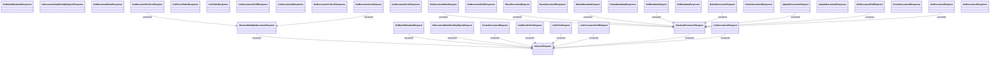

# Standard

```mermaid
classDiagram
    class SetBatchMetadataResponse["SetBatchMetadataResponse"]
    class SetBatchMetadataRequest["SetBatchMetadataRequest"]
    class IsDocumentDataExistByDigestResponse["IsDocumentDataExistByDigestResponse"]
    class IsDocumentDataExistByDigestRequest["IsDocumentDataExistByDigestRequest"]
    class GetDocumentDataResponse["GetDocumentDataResponse"]
    class GetDocumentDataRequest["GetDocumentDataRequest"]
    class ListDirectPathsResponse["ListDirectPathsResponse"]
    class ListDirectPathsRequest["ListDirectPathsRequest"]
    class ListPathsResponse["ListPathsResponse"]
    class ListPathsRequest["ListPathsRequest"]
    class ListDocumentsFullResponse["ListDocumentsFullResponse"]
    class ListDocumentsFullRequest["ListDocumentsFullRequest"]
    class ListDocumentsResponse["ListDocumentsResponse"]
    class ListDocumentsRequest["ListDocumentsRequest"]
    class GetDocumentFullListResponse["GetDocumentFullListResponse"]
    class GetDocumentFullListRequest["GetDocumentFullListRequest"]
    class GetDocumentListResponse["GetDocumentListResponse"]
    class GetDocumentListRequest["GetDocumentListRequest"]
    class GetDocumentFullResponse["GetDocumentFullResponse"]
    class GetDocumentFullRequest["GetDocumentFullRequest"]
    class MoveDocumentResponse["MoveDocumentResponse"]
    class MoveDocumentRequest["MoveDocumentRequest"]
    class DeleteMetadataResponse["DeleteMetadataResponse"]
    class DeleteMetadataRequest["DeleteMetadataRequest"]
    class SetMetadataResponse["SetMetadataResponse"]
    class SetMetadataRequest["SetMetadataRequest"]
    class DeleteDocumentResponse["DeleteDocumentResponse"]
    class DeleteDocumentRequest["DeleteDocumentRequest"]
    class UpdateDocumentResponse["UpdateDocumentResponse"]
    class UpdateDocumentRequest["UpdateDocumentRequest"]
    class CreateDocumentRequest["CreateDocumentRequest"]
    class CreateDocumentResponse["CreateDocumentResponse"]
    class GetDocumentRequest["GetDocumentRequest"]
    class GetDocumentResponse["GetDocumentResponse"]
    class AbstractMultipleDocumentRequest["AbstractMultipleDocumentRequest"]
    class AbstractDocumentRequest["AbstractDocumentRequest"]
    class AbstractRequest["AbstractRequest"]
    AbstractMultipleDocumentRequest --> AbstractRequest : unnamed
    GetDocumentFullListRequest --> AbstractMultipleDocumentRequest : unnamed
    GetDocumentDataRequest --> AbstractDocumentRequest : unnamed
    MoveDocumentRequest --> AbstractDocumentRequest : unnamed
    DeleteMetadataRequest --> AbstractDocumentRequest : unnamed
    SetMetadataRequest --> AbstractDocumentRequest : unnamed
    DeleteDocumentRequest --> AbstractDocumentRequest : unnamed
    UpdateDocumentRequest --> AbstractDocumentRequest : unnamed
    GetDocumentListRequest --> AbstractMultipleDocumentRequest : unnamed
    GetDocumentFullRequest --> AbstractDocumentRequest : unnamed
    SetBatchMetadataRequest --> AbstractRequest : unnamed
    IsDocumentDataExistByDigestRequest --> AbstractRequest : unnamed
    CreateDocumentRequest --> AbstractRequest : unnamed
    ListDirectPathsRequest --> AbstractRequest : unnamed
    ListPathsRequest --> AbstractRequest : unnamed
    ListDocumentsFullRequest --> AbstractRequest : unnamed
    AbstractDocumentRequest --> AbstractRequest : unnamed
    ListDocumentsRequest --> AbstractRequest : unnamed
    GetDocumentRequest --> AbstractDocumentRequest : unnamed
```
