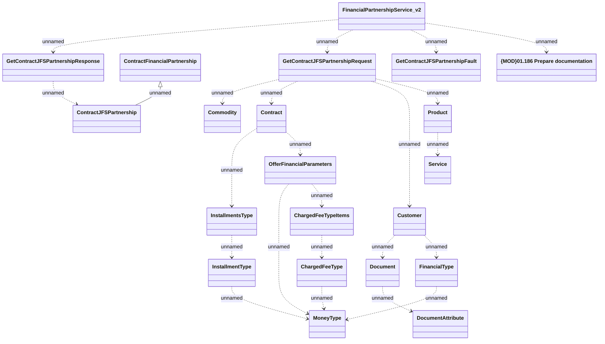

# FinancialPartnershipService_v2

- **Diagram Type**: Logical
- **Package**: HomerSelect/BSL/Analysis Model/_Interface/Consumed services/Financial Partnership/FinancialPartnershipService_v2
- **Diagram ID**: 138025
- **Elements**: 21
- **Connectors**: 23

