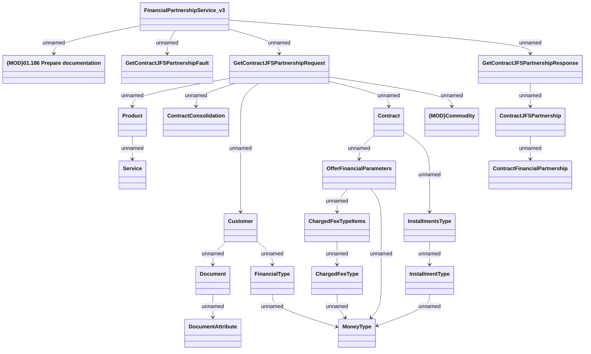

# FinancialPartnershipService_v3

```mermaid
classDiagram
    class MOD_01_186_Prepare_documentation["{MOD}01.186 Prepare documentation"]
    class ContractConsolidation["ContractConsolidation"]
    class ChargedFeeType["ChargedFeeType"]
    class ChargedFeeTypeItems["ChargedFeeTypeItems"]
    class InstallmentType["InstallmentType"]
    class InstallmentsType["InstallmentsType"]
    class FinancialType["FinancialType"]
    class MoneyType["MoneyType"]
    class Service["Service"]
    class Product["Product"]
    class OfferFinancialParameters["OfferFinancialParameters"]
    class DocumentAttribute["DocumentAttribute"]
    class Document["Document"]
    class Customer["Customer"]
    class ContractJFSPartnership["ContractJFSPartnership"]
    class Contract["Contract"]
    class MOD_Commodity["{MOD}Commodity"]
    class ContractFinancialPartnership["ContractFinancialPartnership"]
    class GetContractJFSPartnershipRequest["GetContractJFSPartnershipRequest"]
    class GetContractJFSPartnershipResponse["GetContractJFSPartnershipResponse"]
    class GetContractJFSPartnershipFault["GetContractJFSPartnershipFault"]
    class FinancialPartnershipService_v3["FinancialPartnershipService_v3"]
    GetContractJFSPartnershipRequest --> Product : unnamed
    GetContractJFSPartnershipRequest --> ContractConsolidation : unnamed
    FinancialPartnershipService_v3 --> MOD_01_186_Prepare_documentation : unnamed
    FinancialPartnershipService_v3 --> GetContractJFSPartnershipFault : unnamed
    GetContractJFSPartnershipRequest --> Customer : unnamed
    GetContractJFSPartnershipResponse --> ContractJFSPartnership : unnamed
    GetContractJFSPartnershipRequest --> Contract : unnamed
    GetContractJFSPartnershipRequest --> MOD_Commodity : unnamed
    FinancialPartnershipService_v3 --> GetContractJFSPartnershipRequest : unnamed
    FinancialPartnershipService_v3 --> GetContractJFSPartnershipResponse : unnamed
    OfferFinancialParameters --> ChargedFeeTypeItems : unnamed
    ChargedFeeTypeItems --> ChargedFeeType : unnamed
    Customer --> Document : unnamed
    Customer --> FinancialType : unnamed
    ContractJFSPartnership --> ContractFinancialPartnership : unnamed
    Product --> Service : unnamed
    FinancialType --> MoneyType : unnamed
    InstallmentType --> MoneyType : unnamed
    InstallmentsType --> InstallmentType : unnamed
    OfferFinancialParameters --> MoneyType : unnamed
    ChargedFeeType --> MoneyType : unnamed
    Contract --> OfferFinancialParameters : unnamed
    Contract --> InstallmentsType : unnamed
    Document --> DocumentAttribute : unnamed
```
