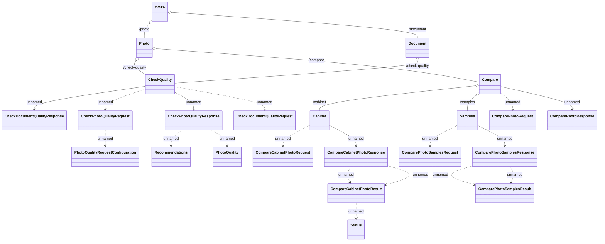

# DOT Adapter API - DOT Adapter Controller

- **Diagram Type**: Logical
- **Package**: HomerSelect/BSL/Analysis Model/_Interface/Consumed services/Fingerprints/DOT Adapter (Digital Onboarding Toolkit Adapter)
- **Diagram ID**: 139538
- **Elements**: 24
- **Connectors**: 25

