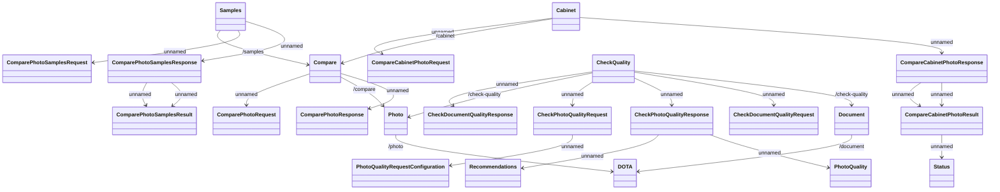

# DOT Adapter API - DOT Adapter Controller

```mermaid
classDiagram
    class Status["Status"]
    class Recommendations["Recommendations"]
    class PhotoQuality["PhotoQuality"]
    class CompareCabinetPhotoResult["CompareCabinetPhotoResult"]
    class CompareCabinetPhotoResponse["CompareCabinetPhotoResponse"]
    class ComparePhotoSamplesResult["ComparePhotoSamplesResult"]
    class ComparePhotoSamplesResponse["ComparePhotoSamplesResponse"]
    class ComparePhotoResponse["ComparePhotoResponse"]
    class CheckPhotoQualityResponse["CheckPhotoQualityResponse"]
    class CheckDocumentQualityResponse["CheckDocumentQualityResponse"]
    class CheckDocumentQualityRequest["CheckDocumentQualityRequest"]
    class PhotoQualityRequestConfiguration["PhotoQualityRequestConfiguration"]
    class CheckPhotoQualityRequest["CheckPhotoQualityRequest"]
    class ComparePhotoRequest["ComparePhotoRequest"]
    class CompareCabinetPhotoRequest["CompareCabinetPhotoRequest"]
    class ComparePhotoSamplesRequest["ComparePhotoSamplesRequest"]
    class CheckQuality["CheckQuality"]
    class CheckQuality["CheckQuality"]
    class Cabinet["Cabinet"]
    class Document["Document"]
    class Samples["Samples"]
    class Compare["Compare"]
    class Photo["Photo"]
    class DOTA["DOTA"]
    CheckQuality --> CheckDocumentQualityResponse : unnamed
    CompareCabinetPhotoResponse --> CompareCabinetPhotoResult : unnamed
    CompareCabinetPhotoResponse --> CompareCabinetPhotoResult : unnamed
    ComparePhotoSamplesResponse --> ComparePhotoSamplesResult : unnamed
    ComparePhotoSamplesResponse --> ComparePhotoSamplesResult : unnamed
    CheckPhotoQualityResponse --> Recommendations : unnamed
    CheckPhotoQualityResponse --> PhotoQuality : unnamed
    CheckPhotoQualityRequest --> PhotoQualityRequestConfiguration : unnamed
    CheckQuality --> Photo : /check-quality
    CheckQuality --> CheckPhotoQualityRequest : unnamed
    CheckQuality --> CheckPhotoQualityResponse : unnamed
    CompareCabinetPhotoResult --> Status : unnamed
    CheckQuality --> CheckDocumentQualityRequest : unnamed
    Photo --> DOTA : /photo
    Cabinet --> CompareCabinetPhotoRequest : unnamed
    Cabinet --> Compare : /cabinet
    Cabinet --> CompareCabinetPhotoResponse : unnamed
    Document --> DOTA : /document
    Samples --> Compare : /samples
    Samples --> ComparePhotoSamplesRequest : unnamed
    Samples --> ComparePhotoSamplesResponse : unnamed
    Compare --> ComparePhotoRequest : unnamed
    Compare --> Photo : /compare
    Compare --> ComparePhotoResponse : unnamed
    CheckQuality --> Document : /check-quality
```
