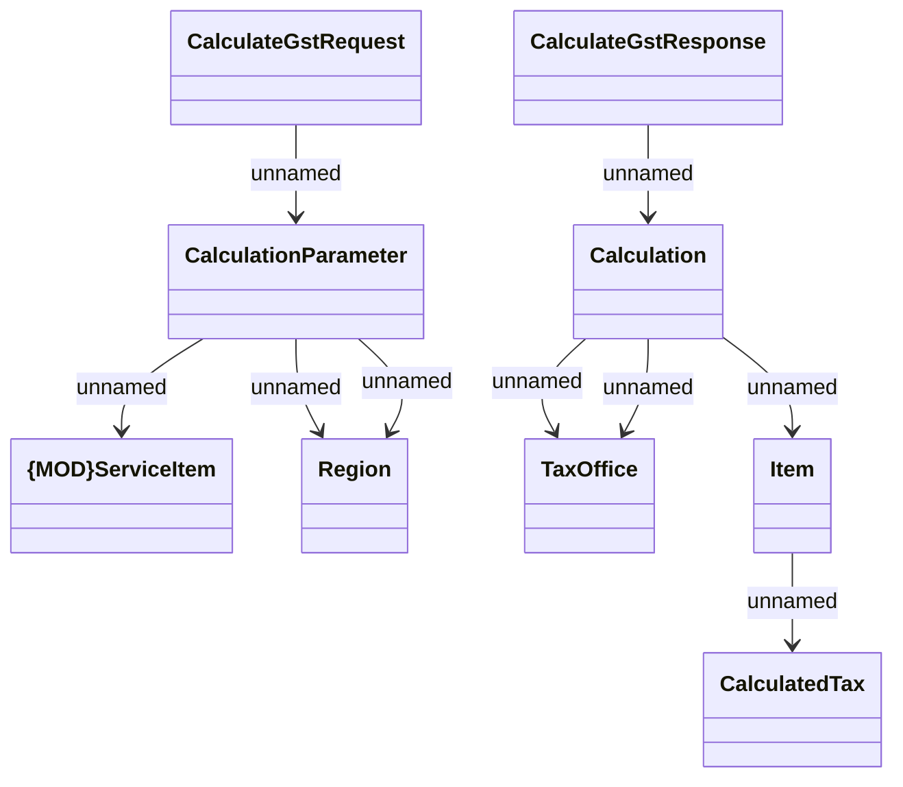

# IN: Goods And Services Taxes

```mermaid
classDiagram
    class Region["Region"]
    class TaxOffice["TaxOffice"]
    class CalculatedTax["CalculatedTax"]
    class Item["Item"]
    class Calculation["Calculation"]
    class MOD_ServiceItem["{MOD}ServiceItem"]
    class CalculationParameter["CalculationParameter"]
    class CalculateGstResponse["CalculateGstResponse"]
    class CalculateGstRequest["CalculateGstRequest"]
    CalculateGstRequest --> CalculationParameter : unnamed
    CalculateGstResponse --> Calculation : unnamed
    CalculationParameter --> MOD_ServiceItem : unnamed
    CalculationParameter --> Region : unnamed
    CalculationParameter --> Region : unnamed
    Calculation --> TaxOffice : unnamed
    Calculation --> TaxOffice : unnamed
    Calculation --> Item : unnamed
    Item --> CalculatedTax : unnamed
```
