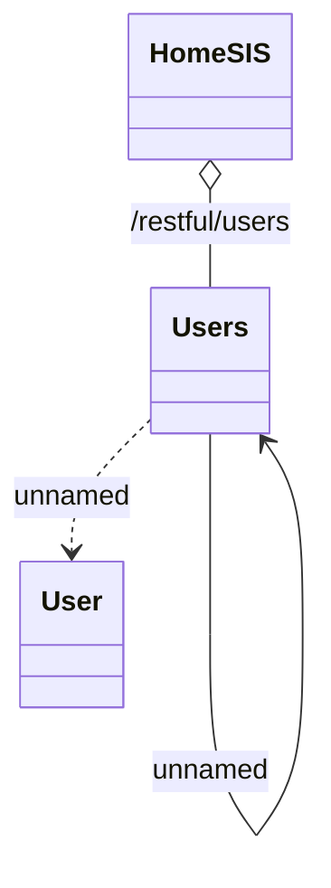

# HomeSIS - Management of users

- **Diagram Type**: Logical
- **Package**: HomerSelect/BSL/Analysis Model/_Interface/Consumed services/HomeSIS
- **Diagram ID**: 131247
- **Elements**: 4
- **Connectors**: 3

