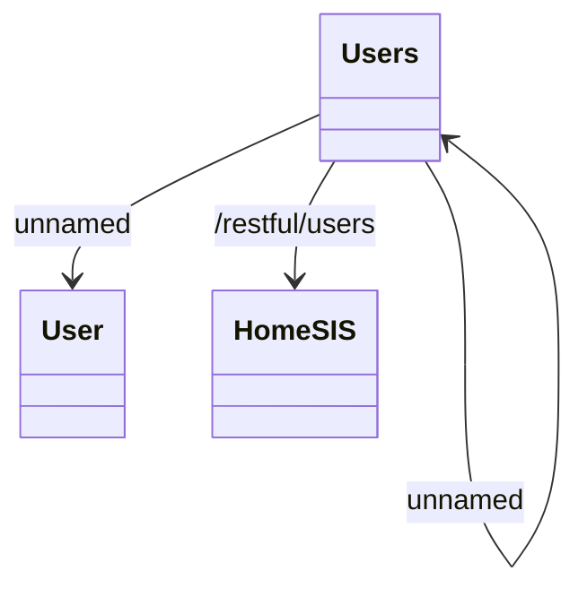

# HomeSIS - Management of users

```mermaid
classDiagram
    class Users["Users"]
    class Users["Users"]
    class User["User"]
    class HomeSIS["HomeSIS"]
    Users --> Users : unnamed
    Users --> User : unnamed
    Users --> HomeSIS : /restful/users
```
