# LoyaltyManagementWS

- **Diagram Type**: Logical
- **Package**: HomerSelect/BSL/Analysis Model/_Interface/Consumed services/Loyalty system
- **Diagram ID**: 81632
- **Elements**: 23
- **Connectors**: 12

```mermaid
classDiagram
    class ADD_SchemaType["{ADD}SchemaType"]
    class ADD_SchemaListType["{ADD}SchemaListType"]
    class ADD_GetListOfRewardSchemasResponse["{ADD}GetListOfRewardSchemasResponse"]
    class ADD_GetListOfRewardSchemasRequest["{ADD}GetListOfRewardSchemasRequest"]
    class UseCase_Model_Pay_off_contracts_from_external_system["UseCase Model : Pay-off contracts from external system"]
    class UseCase_Model_Pay_off_contract_manually["UseCase Model : Pay off contract manually"]
    class CancelAccountTerminationResponse["CancelAccountTerminationResponse"]
    class CancelAccountTerminationRequest["CancelAccountTerminationRequest"]
    class Use_Case_Model_Processing_a_notification_about_credit_accoun["Use Case Model : Processing a notification about credit account closure"]
    class UseCase_Model_Cancel_contract_manually_Use_case_diagram["UseCase Model : Cancel contract manually - Use case diagram"]
    class UseCase_Model_Cancel_contract_automatically_Use_case_diagram["UseCase Model : Cancel contract automatically - Use case diagram"]
    class UseCase_Model_Contract_signing["UseCase Model : Contract signing"]
    class UseCase_Model_REL_contract_termination_request["UseCase Model : REL contract termination request"]
    class InitiateAccountTerminationResponse["InitiateAccountTerminationResponse"]
    class MOD_InitiateAccountTerminationRequest["{MOD}InitiateAccountTerminationRequest"]
    class CancelAccountResponse["CancelAccountResponse"]
    class CancelAccountRequest["CancelAccountRequest"]
    class Mapping_rules_LoyaltyManagementWS_mapping_rules["Mapping rules : LoyaltyManagementWS - mapping rules"]
    class CreateAccountResponse["CreateAccountResponse"]
    class CreateAccountRequest["CreateAccountRequest"]
    class Types_Types_LoyaltyManagementWS["Types : Types - LoyaltyManagementWS"]
    class Messages_Messages_LoyaltyManagementWS["Messages : Messages - LoyaltyManagementWS"]
    class LoyaltyManagementWS["LoyaltyManagementWS"]
    LoyaltyManagementWS ..> CreateAccountRequest : unnamed
    LoyaltyManagementWS ..> CreateAccountResponse : unnamed
    LoyaltyManagementWS ..> CancelAccountRequest : unnamed
    LoyaltyManagementWS ..> CancelAccountResponse : unnamed
    LoyaltyManagementWS ..> MOD_InitiateAccountTerminationRequest : unnamed
    LoyaltyManagementWS ..> InitiateAccountTerminationResponse : unnamed
    LoyaltyManagementWS ..> CancelAccountTerminationRequest : unnamed
    LoyaltyManagementWS ..> CancelAccountTerminationResponse : unnamed
    LoyaltyManagementWS ..> ADD_GetListOfRewardSchemasRequest : unnamed
    LoyaltyManagementWS ..> ADD_GetListOfRewardSchemasResponse : unnamed
    ADD_SchemaListType <|-- ADD_GetListOfRewardSchemasResponse : unnamed
    ADD_SchemaType ..> ADD_SchemaListType : unnamed
```

