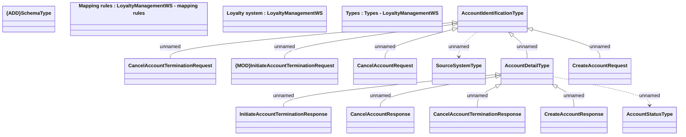

# Messages - LoyaltyManagementWS

- **Diagram Type**: Logical
- **Package**: HomerSelect/BSL/Analysis Model/_Interface/Consumed services/Loyalty system/Messages
- **Diagram ID**: 81634
- **Elements**: 16
- **Connectors**: 12

