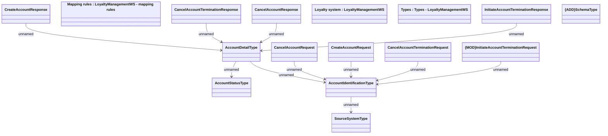

# Messages - LoyaltyManagementWS

```mermaid
classDiagram
    class CancelAccountTerminationResponse["CancelAccountTerminationResponse"]
    class CancelAccountTerminationRequest["CancelAccountTerminationRequest"]
    class Mapping_rules_LoyaltyManagementWS_mapping_rules["Mapping rules : LoyaltyManagementWS - mapping rules"]
    class InitiateAccountTerminationResponse["InitiateAccountTerminationResponse"]
    class CancelAccountResponse["CancelAccountResponse"]
    class MOD_InitiateAccountTerminationRequest["{MOD}InitiateAccountTerminationRequest"]
    class CancelAccountRequest["CancelAccountRequest"]
    class SourceSystemType["SourceSystemType"]
    class AccountStatusType["AccountStatusType"]
    class AccountDetailType["AccountDetailType"]
    class Loyalty_system_LoyaltyManagementWS["Loyalty system : LoyaltyManagementWS"]
    class Types_Types_LoyaltyManagementWS["Types : Types - LoyaltyManagementWS"]
    class CreateAccountResponse["CreateAccountResponse"]
    class AccountIdentificationType["AccountIdentificationType"]
    class CreateAccountRequest["CreateAccountRequest"]
    class ADD_SchemaType["{ADD}SchemaType"]
    MOD_InitiateAccountTerminationRequest --> AccountIdentificationType : unnamed
    CancelAccountTerminationRequest --> AccountIdentificationType : unnamed
    CreateAccountRequest --> AccountIdentificationType : unnamed
    CancelAccountRequest --> AccountIdentificationType : unnamed
    InitiateAccountTerminationResponse --> AccountDetailType : unnamed
    CancelAccountResponse --> AccountDetailType : unnamed
    CancelAccountTerminationResponse --> AccountDetailType : unnamed
    CreateAccountResponse --> AccountDetailType : unnamed
    AccountIdentificationType --> SourceSystemType : unnamed
    AccountDetailType --> AccountIdentificationType : unnamed
    AccountDetailType --> AccountStatusType : unnamed
```
