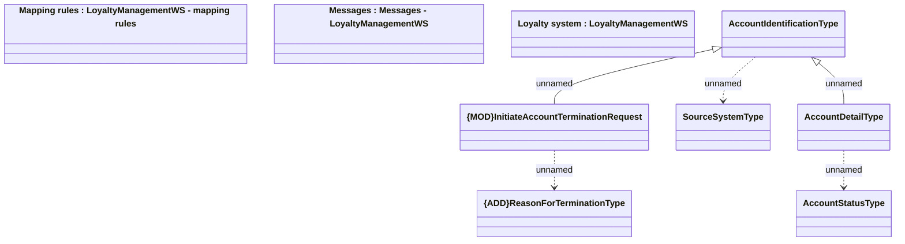

# Types - LoyaltyManagementWS

- **Diagram Type**: Logical
- **Package**: HomerSelect/BSL/Analysis Model/_Interface/Consumed services/Loyalty system/Types
- **Diagram ID**: 81635
- **Elements**: 9
- **Connectors**: 5

