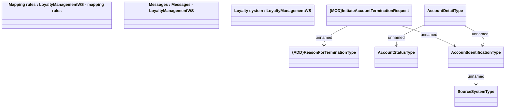

# Types - LoyaltyManagementWS

```mermaid
classDiagram
    class ADD_ReasonForTerminationType["{ADD}ReasonForTerminationType"]
    class Mapping_rules_LoyaltyManagementWS_mapping_rules["Mapping rules : LoyaltyManagementWS - mapping rules"]
    class Messages_Messages_LoyaltyManagementWS["Messages : Messages - LoyaltyManagementWS"]
    class Loyalty_system_LoyaltyManagementWS["Loyalty system : LoyaltyManagementWS"]
    class MOD_InitiateAccountTerminationRequest["{MOD}InitiateAccountTerminationRequest"]
    class AccountStatusType["AccountStatusType"]
    class SourceSystemType["SourceSystemType"]
    class AccountDetailType["AccountDetailType"]
    class AccountIdentificationType["AccountIdentificationType"]
    MOD_InitiateAccountTerminationRequest --> AccountIdentificationType : unnamed
    AccountDetailType --> AccountIdentificationType : unnamed
    AccountIdentificationType --> SourceSystemType : unnamed
    AccountDetailType --> AccountStatusType : unnamed
    MOD_InitiateAccountTerminationRequest --> ADD_ReasonForTerminationType : unnamed
```
