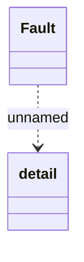

# Custom SOAP Faults

- **Diagram Type**: Logical
- **Package**: HomerSelect/BSL/Analysis Model/_Interface/Consumed services/Message Server/COMMON for Message Server/Custom SOAP Faults
- **Diagram ID**: 99212
- **Elements**: 2
- **Connectors**: 1

