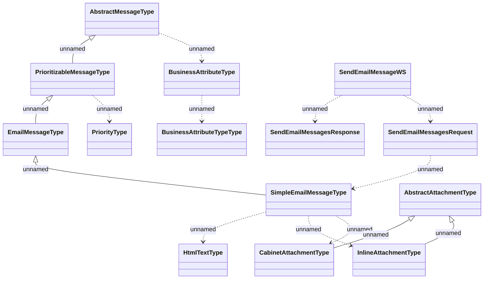

# SendEmailMessageWS

- **Diagram Type**: Logical
- **Package**: HomerSelect/BSL/Analysis Model/_Interface/Consumed services/Message Server/SendEmailMessageWS
- **Diagram ID**: 92048
- **Elements**: 14
- **Connectors**: 14

