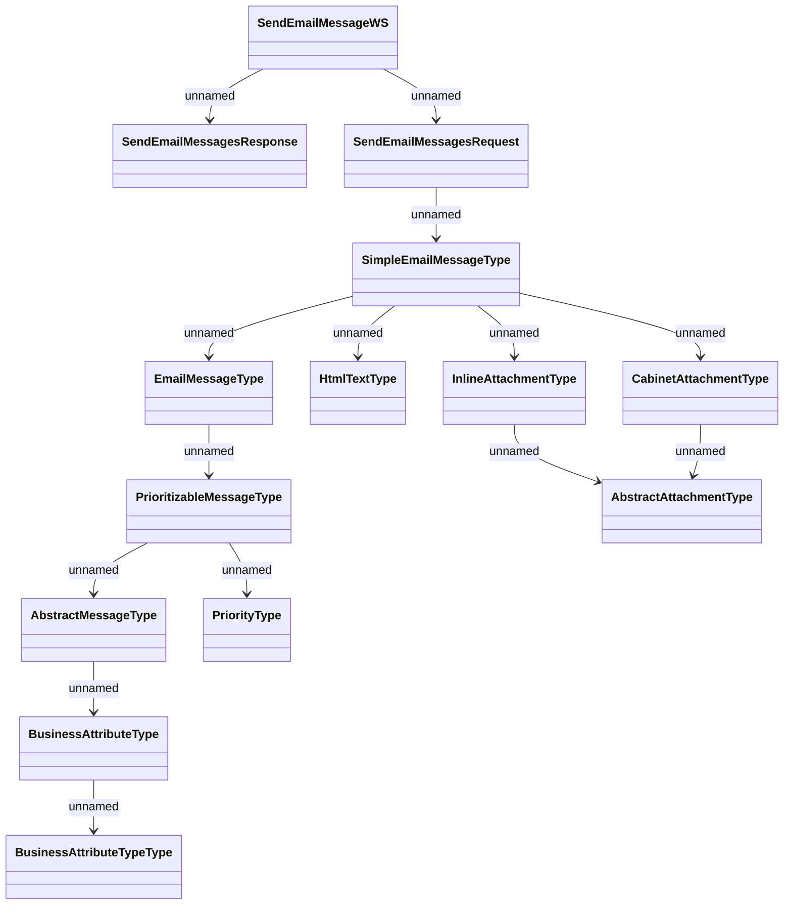

# SendEmailMessageWS

```mermaid
classDiagram
    class SimpleEmailMessageType["SimpleEmailMessageType"]
    class EmailMessageType["EmailMessageType"]
    class PrioritizableMessageType["PrioritizableMessageType"]
    class AbstractMessageType["AbstractMessageType"]
    class BusinessAttributeType["BusinessAttributeType"]
    class BusinessAttributeTypeType["BusinessAttributeTypeType"]
    class PriorityType["PriorityType"]
    class HtmlTextType["HtmlTextType"]
    class InlineAttachmentType["InlineAttachmentType"]
    class AbstractAttachmentType["AbstractAttachmentType"]
    class CabinetAttachmentType["CabinetAttachmentType"]
    class SendEmailMessagesResponse["SendEmailMessagesResponse"]
    class SendEmailMessagesRequest["SendEmailMessagesRequest"]
    class SendEmailMessageWS["SendEmailMessageWS"]
    SendEmailMessageWS --> SendEmailMessagesRequest : unnamed
    SendEmailMessageWS --> SendEmailMessagesResponse : unnamed
    SimpleEmailMessageType --> CabinetAttachmentType : unnamed
    InlineAttachmentType --> AbstractAttachmentType : unnamed
    CabinetAttachmentType --> AbstractAttachmentType : unnamed
    SimpleEmailMessageType --> InlineAttachmentType : unnamed
    SimpleEmailMessageType --> HtmlTextType : unnamed
    PrioritizableMessageType --> PriorityType : unnamed
    BusinessAttributeType --> BusinessAttributeTypeType : unnamed
    AbstractMessageType --> BusinessAttributeType : unnamed
    PrioritizableMessageType --> AbstractMessageType : unnamed
    EmailMessageType --> PrioritizableMessageType : unnamed
    SimpleEmailMessageType --> EmailMessageType : unnamed
    SendEmailMessagesRequest --> SimpleEmailMessageType : unnamed
```
