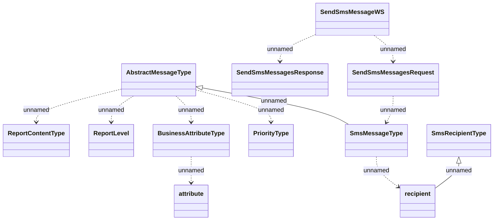

# SendSmsMessageWS

- **Diagram Type**: Logical
- **Package**: HomerSelect/BSL/Analysis Model/_Interface/Consumed services/Message Server/SendSmsMessageWS
- **Diagram ID**: 98433
- **Elements**: 12
- **Connectors**: 11

