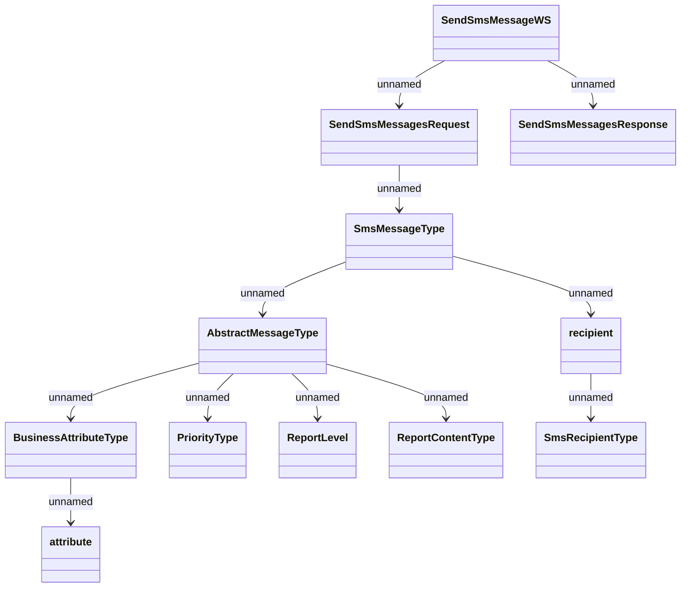

# SendSmsMessageWS

```mermaid
classDiagram
    class ReportContentType["ReportContentType"]
    class ReportLevel["ReportLevel"]
    class recipient["recipient"]
    class SmsRecipientType["SmsRecipientType"]
    class PriorityType["PriorityType"]
    class attribute["attribute"]
    class BusinessAttributeType["BusinessAttributeType"]
    class AbstractMessageType["AbstractMessageType"]
    class SmsMessageType["SmsMessageType"]
    class SendSmsMessagesResponse["SendSmsMessagesResponse"]
    class SendSmsMessagesRequest["SendSmsMessagesRequest"]
    class SendSmsMessageWS["SendSmsMessageWS"]
    SendSmsMessageWS --> SendSmsMessagesRequest : unnamed
    SendSmsMessageWS --> SendSmsMessagesResponse : unnamed
    SendSmsMessagesRequest --> SmsMessageType : unnamed
    SmsMessageType --> AbstractMessageType : unnamed
    AbstractMessageType --> BusinessAttributeType : unnamed
    BusinessAttributeType --> attribute : unnamed
    AbstractMessageType --> PriorityType : unnamed
    recipient --> SmsRecipientType : unnamed
    SmsMessageType --> recipient : unnamed
    AbstractMessageType --> ReportLevel : unnamed
    AbstractMessageType --> ReportContentType : unnamed
```
