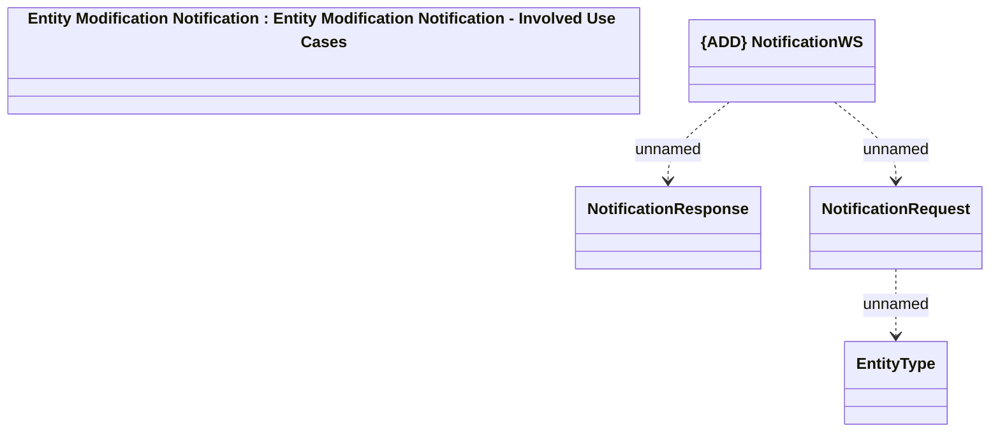

# Entity Modification Notification - Interface

- **Diagram Type**: Logical
- **Package**: HomerSelect/BSL/Analysis Model/_Interface/Consumed services/Notifications/Entity Modification Notification
- **Diagram ID**: 162291
- **Elements**: 5
- **Connectors**: 3

