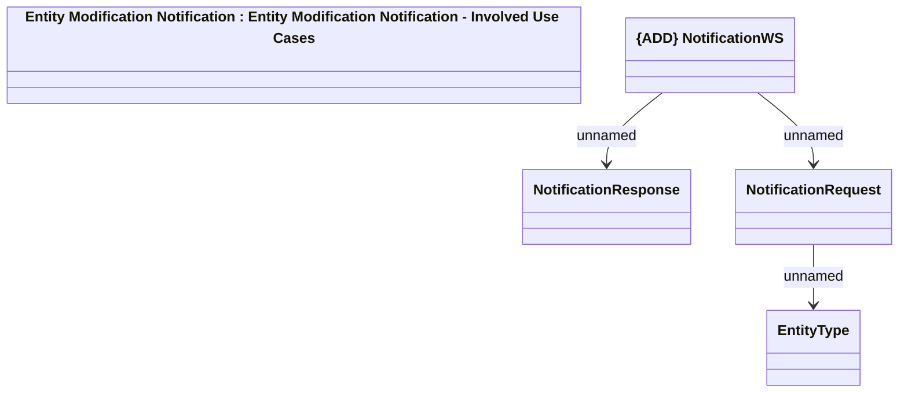

# Entity Modification Notification - Interface

```mermaid
classDiagram
    class Entity_Modification_Notification_Entity_Modification_Notific["Entity Modification Notification : Entity Modification Notification - Involved Use Cases"]
    class EntityType["EntityType"]
    class NotificationResponse["NotificationResponse"]
    class NotificationRequest["NotificationRequest"]
    class ADD_NotificationWS["{ADD} NotificationWS"]
    ADD_NotificationWS --> NotificationRequest : unnamed
    ADD_NotificationWS --> NotificationResponse : unnamed
    NotificationRequest --> EntityType : unnamed
```
