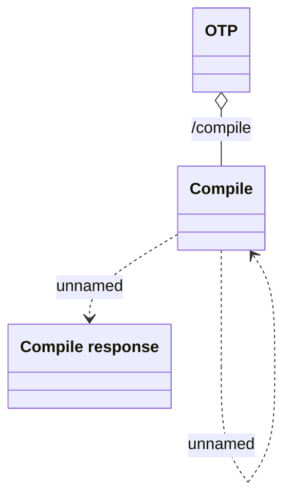

# Compile REST

- **Diagram Type**: Logical
- **Package**: HomerSelect/BSL/Analysis Model/_Interface/Consumed services/OTP - One Time Password/Evaluate REST
- **Diagram ID**: 133287
- **Elements**: 4
- **Connectors**: 3

