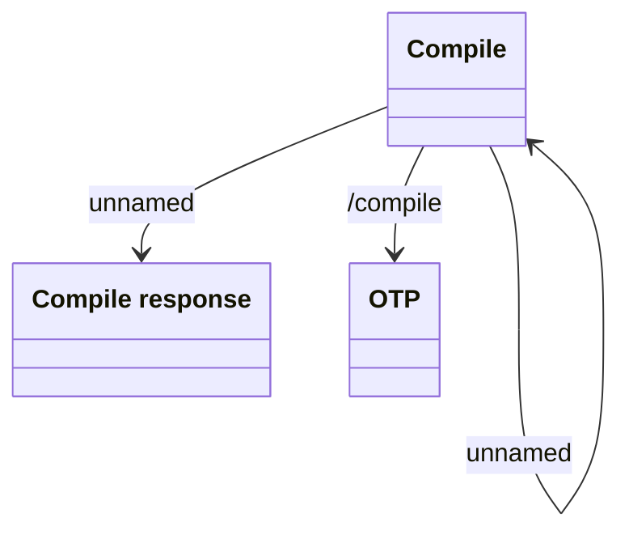

# Compile REST

```mermaid
classDiagram
    class Compile_response["Compile response"]
    class Compile["Compile"]
    class Compile["Compile"]
    class OTP["OTP"]
    Compile --> OTP : /compile
    Compile --> Compile : unnamed
    Compile --> Compile_response : unnamed
```
