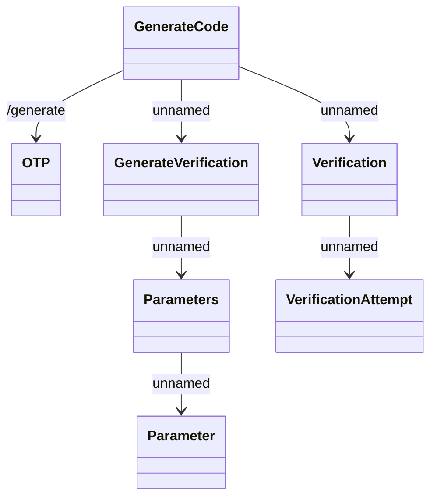

# Generation REST

```mermaid
classDiagram
    class Parameter["Parameter"]
    class Parameters["Parameters"]
    class OTP["OTP"]
    class VerificationAttempt["VerificationAttempt"]
    class Verification["Verification"]
    class GenerateVerification["GenerateVerification"]
    class GenerateCode["GenerateCode"]
    GenerateCode --> GenerateVerification : unnamed
    GenerateCode --> Verification : unnamed
    GenerateCode --> OTP : /generate
    GenerateVerification --> Parameters : unnamed
    Verification --> VerificationAttempt : unnamed
    Parameters --> Parameter : unnamed
```
