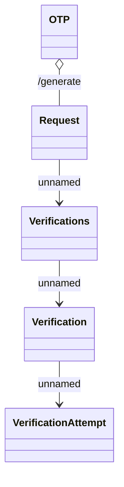

# Search REST

- **Diagram Type**: Logical
- **Package**: HomerSelect/BSL/Analysis Model/_Interface/Consumed services/OTP - One Time Password/{ADD}Verification REST
- **Diagram ID**: 133310
- **Elements**: 5
- **Connectors**: 4

