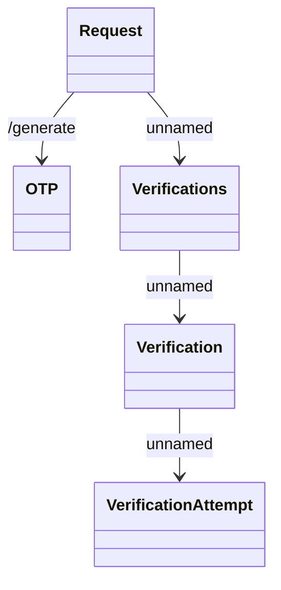

# Search REST

```mermaid
classDiagram
    class OTP["OTP"]
    class VerificationAttempt["VerificationAttempt"]
    class Verification["Verification"]
    class Verifications["Verifications"]
    class Request["Request"]
    Request --> Verifications : unnamed
    Request --> OTP : /generate
    Verifications --> Verification : unnamed
    Verification --> VerificationAttempt : unnamed
```
