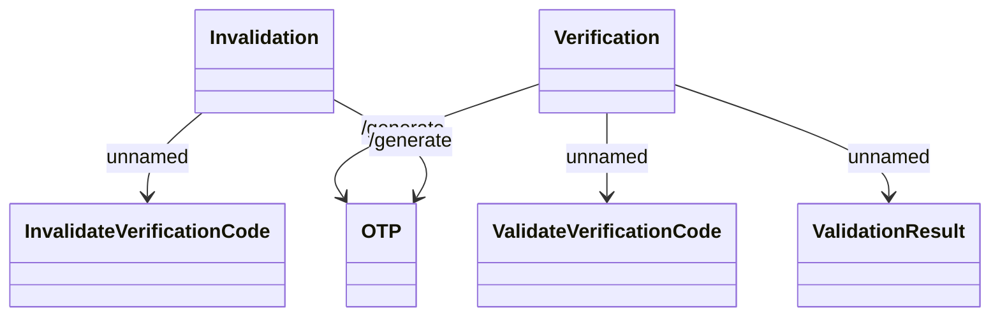

# Verification REST

```mermaid
classDiagram
    class OTP["OTP"]
    class InvalidateVerificationCode["InvalidateVerificationCode"]
    class Invalidation["Invalidation"]
    class ValidationResult["ValidationResult"]
    class ValidateVerificationCode["ValidateVerificationCode"]
    class Verification["Verification"]
    Verification --> ValidateVerificationCode : unnamed
    Verification --> ValidationResult : unnamed
    Verification --> OTP : /generate
    Invalidation --> InvalidateVerificationCode : unnamed
    Invalidation --> OTP : /generate
```
