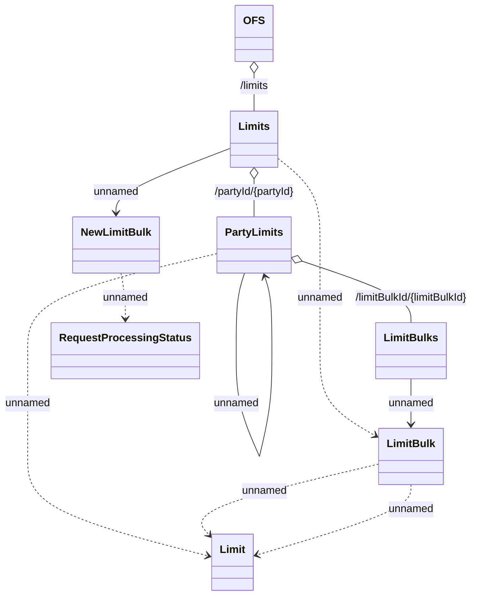

# Offer Store API - Limit Controller (Management of customer limits)

- **Diagram Type**: Logical
- **Package**: HomerSelect/BSL/Analysis Model/_Interface/Consumed services/Offer Store
- **Diagram ID**: 154149
- **Elements**: 11
- **Connectors**: 11

