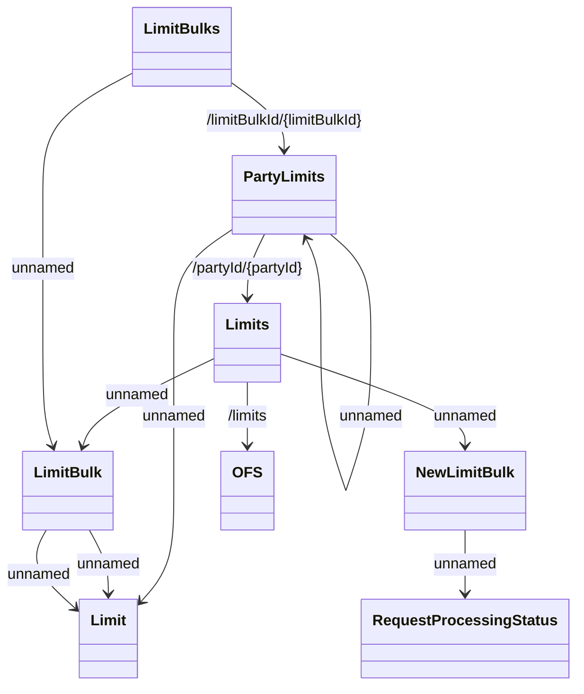

# Offer Store API - Limit Controller (Management of customer limits)

```mermaid
classDiagram
    class NewLimitBulk["NewLimitBulk"]
    class LimitBulk["LimitBulk"]
    class Limit["Limit"]
    class LimitBulk["LimitBulk"]
    class PartyLimits["PartyLimits"]
    class LimitBulks["LimitBulks"]
    class Limits["Limits"]
    class PartyLimits["PartyLimits"]
    class OFS["OFS"]
    class RequestProcessingStatus["RequestProcessingStatus"]
    class Limit["Limit"]
    PartyLimits --> PartyLimits : unnamed
    PartyLimits --> Limits : /partyId/{partyId}
    Limits --> OFS : /limits
    Limits --> NewLimitBulk : unnamed
    Limits --> LimitBulk : unnamed
    LimitBulks --> LimitBulk : unnamed
    LimitBulks --> PartyLimits : /limitBulkId/{limitBulkId}
    PartyLimits --> Limit : unnamed
    LimitBulk --> Limit : unnamed
    LimitBulk --> Limit : unnamed
    NewLimitBulk --> RequestProcessingStatus : unnamed
```
