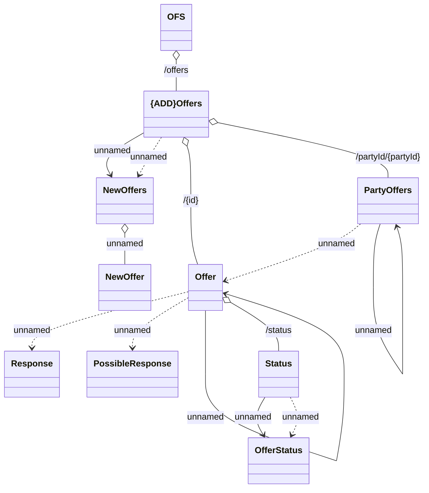

# Offer Store API - Offer Controller (Management of customer offers)

- **Diagram Type**: Logical
- **Package**: HomerSelect/BSL/Analysis Model/_Interface/Consumed services/Offer Store
- **Diagram ID**: 154150
- **Elements**: 14
- **Connectors**: 14

