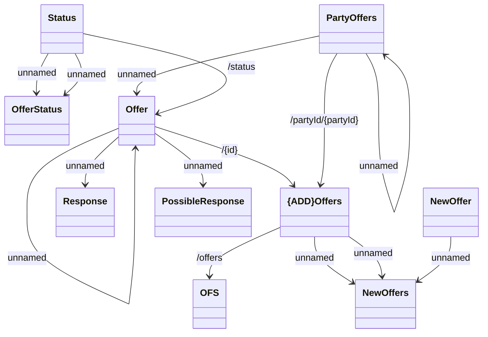

# Offer Store API - Offer Controller (Management of customer offers)

```mermaid
classDiagram
    class OfferStatus["OfferStatus"]
    class OfferStatus["OfferStatus"]
    class Status["Status"]
    class PartyOffers["PartyOffers"]
    class Offer["Offer"]
    class NewOffers["NewOffers"]
    class NewOffer["NewOffer"]
    class NewOffers["NewOffers"]
    class Response["Response"]
    class ADD_Offers["{ADD}Offers"]
    class OFS["OFS"]
    class PartyOffers["PartyOffers"]
    class PossibleResponse["PossibleResponse"]
    class Offer["Offer"]
    Offer --> Response : unnamed
    Offer --> PossibleResponse : unnamed
    PartyOffers --> Offer : unnamed
    ADD_Offers --> OFS : /offers
    ADD_Offers --> NewOffers : unnamed
    ADD_Offers --> NewOffers : unnamed
    NewOffer --> NewOffers : unnamed
    Offer --> Offer : unnamed
    Offer --> ADD_Offers : /{id}
    PartyOffers --> PartyOffers : unnamed
    PartyOffers --> ADD_Offers : /partyId/{partyId}
    Status --> OfferStatus : unnamed
    Status --> Offer : /status
    Status --> OfferStatus : unnamed
```
