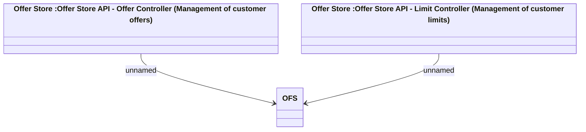

# Offer Store API

- **Diagram Type**: Logical
- **Package**: HomerSelect/BSL/Analysis Model/_Interface/Consumed services/Offer Store
- **Diagram ID**: 154151
- **Elements**: 3
- **Connectors**: 2

