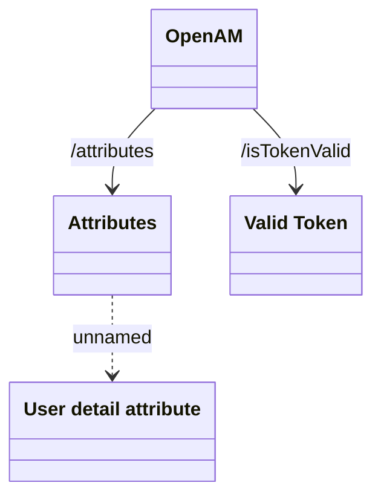

# OpenAM

- **Diagram Type**: Logical
- **Package**: HomerSelect/BSL/Analysis Model/_Interface/Consumed services/OpenAM
- **Diagram ID**: 116496
- **Elements**: 4
- **Connectors**: 3

```mermaid
classDiagram
    class User_detail_attribute["User detail attribute"]
    class Attributes["Attributes"]
    class Valid_Token["Valid Token"]
    class OpenAM["OpenAM"]
    OpenAM --> Valid_Token : /isTokenValid
    OpenAM --> Attributes : /attributes
    Attributes ..> User_detail_attribute : unnamed
```
