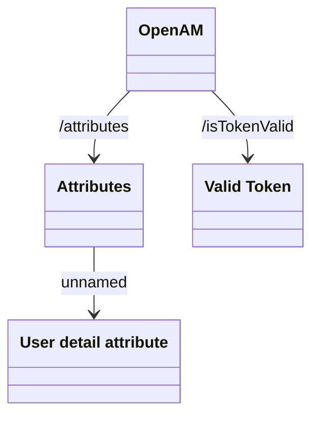

# OpenAM

```mermaid
classDiagram
    class User_detail_attribute["User detail attribute"]
    class Attributes["Attributes"]
    class Valid_Token["Valid Token"]
    class OpenAM["OpenAM"]
    OpenAM --> Valid_Token : /isTokenValid
    OpenAM --> Attributes : /attributes
    Attributes --> User_detail_attribute : unnamed
```
