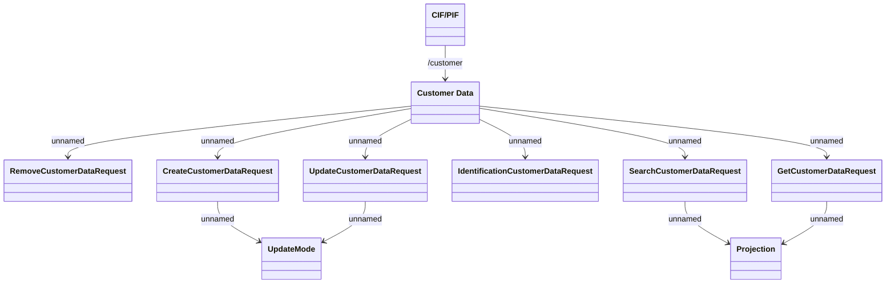

# Customer Data - Requests

- **Diagram Type**: Logical
- **Package**: HomerSelect/BSL/Analysis Model/_Interface/Consumed services/PIF REST API/v1
- **Diagram ID**: 151925
- **Elements**: 10
- **Connectors**: 11

