# Customer Data - Responses

- **Diagram Type**: Logical
- **Package**: HomerSelect/BSL/Analysis Model/_Interface/Consumed services/PIF REST API/v1
- **Diagram ID**: 151927
- **Elements**: 10
- **Connectors**: 14

```mermaid
classDiagram
    class FieldError["FieldError"]
    class ResultCode["ResultCode"]
    class ClientDataResponse["ClientDataResponse"]
    class UpdateCustomerDataResponse["UpdateCustomerDataResponse"]
    class RemoveCustomerDataResponse["RemoveCustomerDataResponse"]
    class IdentificationCustomerDataResponse["IdentificationCustomerDataResponse"]
    class GetCustomerDataResponse["GetCustomerDataResponse"]
    class SearchCustomertDataResponse["SearchCustomertDataResponse"]
    class CreateCustomerDataResponse["CreateCustomerDataResponse"]
    class Customer_Data["Customer Data"]
    Customer_Data --> UpdateCustomerDataResponse : unnamed
    Customer_Data --> RemoveCustomerDataResponse : unnamed
    Customer_Data --> IdentificationCustomerDataResponse : unnamed
    Customer_Data --> GetCustomerDataResponse : unnamed
    Customer_Data --> CreateCustomerDataResponse : unnamed
    Customer_Data --> SearchCustomertDataResponse : unnamed
    ClientDataResponse <|-- CreateCustomerDataResponse : unnamed
    ClientDataResponse <|-- SearchCustomertDataResponse : unnamed
    ClientDataResponse <|-- GetCustomerDataResponse : unnamed
    ClientDataResponse <|-- IdentificationCustomerDataResponse : unnamed
    ClientDataResponse <|-- RemoveCustomerDataResponse : unnamed
    ClientDataResponse <|-- UpdateCustomerDataResponse : unnamed
    ClientDataResponse --> FieldError : unnamed
    ClientDataResponse --> ResultCode : unnamed
```

