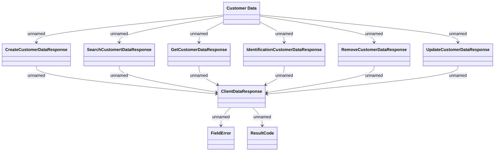

# Customer Data - Responses

```mermaid
classDiagram
    class FieldError["FieldError"]
    class ResultCode["ResultCode"]
    class ClientDataResponse["ClientDataResponse"]
    class UpdateCustomerDataResponse["UpdateCustomerDataResponse"]
    class RemoveCustomerDataResponse["RemoveCustomerDataResponse"]
    class IdentificationCustomerDataResponse["IdentificationCustomerDataResponse"]
    class GetCustomerDataResponse["GetCustomerDataResponse"]
    class SearchCustomertDataResponse["SearchCustomertDataResponse"]
    class CreateCustomerDataResponse["CreateCustomerDataResponse"]
    class Customer_Data["Customer Data"]
    Customer_Data --> UpdateCustomerDataResponse : unnamed
    Customer_Data --> RemoveCustomerDataResponse : unnamed
    Customer_Data --> IdentificationCustomerDataResponse : unnamed
    Customer_Data --> GetCustomerDataResponse : unnamed
    Customer_Data --> CreateCustomerDataResponse : unnamed
    Customer_Data --> SearchCustomertDataResponse : unnamed
    CreateCustomerDataResponse --> ClientDataResponse : unnamed
    SearchCustomertDataResponse --> ClientDataResponse : unnamed
    GetCustomerDataResponse --> ClientDataResponse : unnamed
    IdentificationCustomerDataResponse --> ClientDataResponse : unnamed
    RemoveCustomerDataResponse --> ClientDataResponse : unnamed
    UpdateCustomerDataResponse --> ClientDataResponse : unnamed
    ClientDataResponse --> FieldError : unnamed
    ClientDataResponse --> ResultCode : unnamed
```
