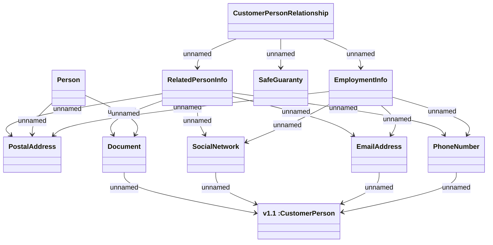

# CustomerPerson - Person

```mermaid
classDiagram
    class PostalAddress["PostalAddress"]
    class v1_1_CustomerPerson["v1.1 :CustomerPerson"]
    class SocialNetwork["SocialNetwork"]
    class PhoneNumber["PhoneNumber"]
    class EmailAddress["EmailAddress"]
    class EmploymentInfo["EmploymentInfo"]
    class v1_1_CustomerPerson["v1.1 :CustomerPerson"]
    class Document["Document"]
    class Person["Person"]
    class SafeGuaranty["SafeGuaranty"]
    class RelatedPersonInfo["RelatedPersonInfo"]
    class CustomerPersonRelationship["CustomerPersonRelationship"]
    Person --> Document : unnamed
    PhoneNumber --> v1_1_CustomerPerson : unnamed
    EmailAddress --> v1_1_CustomerPerson : unnamed
    EmploymentInfo --> PhoneNumber : unnamed
    EmploymentInfo --> SocialNetwork : unnamed
    EmploymentInfo --> EmailAddress : unnamed
    EmploymentInfo --> PostalAddress : unnamed
    SocialNetwork --> v1_1_CustomerPerson : unnamed
    Person --> PostalAddress : unnamed
    CustomerPersonRelationship --> SafeGuaranty : unnamed
    RelatedPersonInfo --> PhoneNumber : unnamed
    RelatedPersonInfo --> SocialNetwork : unnamed
    RelatedPersonInfo --> EmailAddress : unnamed
    RelatedPersonInfo --> PostalAddress : unnamed
    RelatedPersonInfo --> Document : unnamed
    CustomerPersonRelationship --> RelatedPersonInfo : unnamed
    CustomerPersonRelationship --> EmploymentInfo : unnamed
    Document --> v1_1_CustomerPerson : unnamed
```
