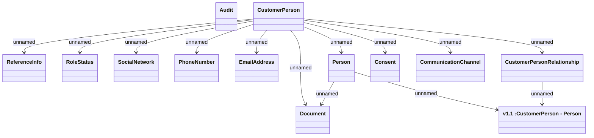

# CustomerPerson

- **Diagram Type**: Logical
- **Package**: HomerSelect/BSL/Analysis Model/_Interface/Consumed services/PIF REST API/v1
- **Diagram ID**: 151926
- **Elements**: 15
- **Connectors**: 13

