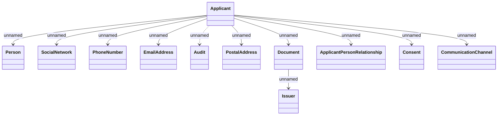

# Applicant

- **Diagram Type**: Logical
- **Package**: HomerSelect/BSL/Analysis Model/_Interface/Consumed services/PIF REST API/v1/applicant
- **Diagram ID**: 132775
- **Elements**: 12
- **Connectors**: 11

