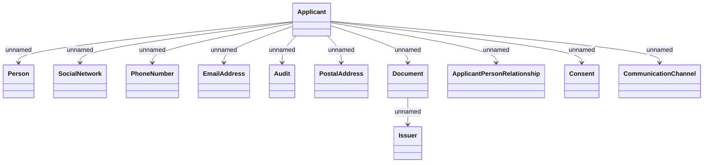

# Applicant

```mermaid
classDiagram
    class Person["Person"]
    class SocialNetwork["SocialNetwork"]
    class PhoneNumber["PhoneNumber"]
    class EmailAddress["EmailAddress"]
    class Issuer["Issuer"]
    class Audit["Audit"]
    class PostalAddress["PostalAddress"]
    class Document["Document"]
    class ApplicantPersonRelationship["ApplicantPersonRelationship"]
    class Consent["Consent"]
    class CommunicationChannel["CommunicationChannel"]
    class Applicant["Applicant"]
    Applicant --> SocialNetwork : unnamed
    Applicant --> PhoneNumber : unnamed
    Applicant --> EmailAddress : unnamed
    Document --> Issuer : unnamed
    Applicant --> Person : unnamed
    Applicant --> CommunicationChannel : unnamed
    Applicant --> Audit : unnamed
    Applicant --> PostalAddress : unnamed
    Applicant --> Document : unnamed
    Applicant --> ApplicantPersonRelationship : unnamed
    Applicant --> Consent : unnamed
```
