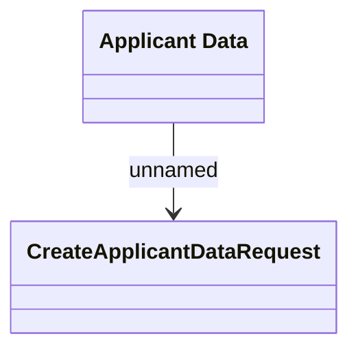

# v1/applicant

- **Diagram Type**: Logical
- **Package**: HomerSelect/BSL/Analysis Model/_Interface/Consumed services/PIF REST API/v1/applicant
- **Diagram ID**: 132774
- **Elements**: 2
- **Connectors**: 1

