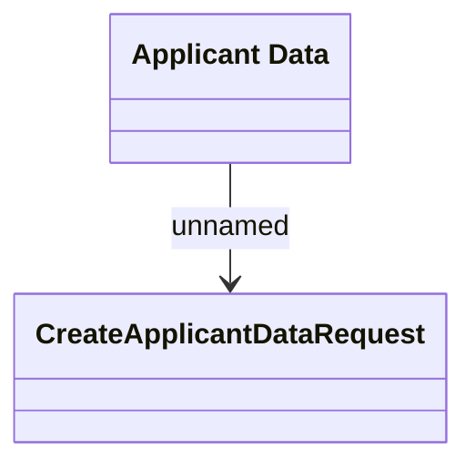

# v1/applicant

```mermaid
classDiagram
    class CreateApplicantDataRequest["CreateApplicantDataRequest"]
    class Applicant_Data["Applicant Data"]
    Applicant_Data --> CreateApplicantDataRequest : unnamed
```
