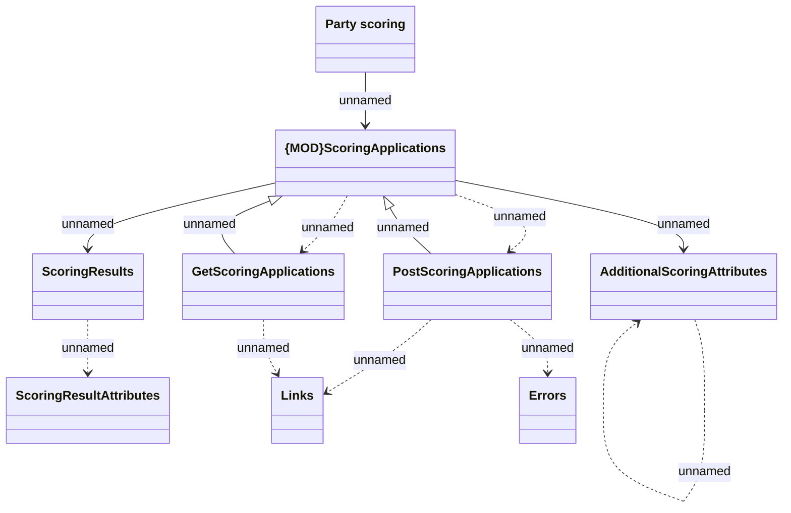

# PartyScoring v4

- **Diagram Type**: Logical
- **Package**: HomerSelect/BSL/Analysis Model/_Interface/Consumed services/Party scoring tool/PartyScoring v4
- **Diagram ID**: 164325
- **Elements**: 10
- **Connectors**: 12

