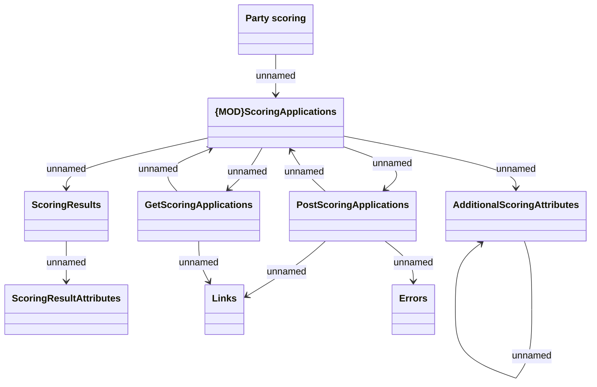

# PartyScoring v4

```mermaid
classDiagram
    class MOD_ScoringApplications["{MOD}ScoringApplications"]
    class ScoringResultAttributes["ScoringResultAttributes"]
    class Links["Links"]
    class AdditionalScoringAttributes["AdditionalScoringAttributes"]
    class Errors["Errors"]
    class PostScoringApplications["PostScoringApplications"]
    class GetScoringApplications["GetScoringApplications"]
    class AdditionalScoringAttributes["AdditionalScoringAttributes"]
    class ScoringResults["ScoringResults"]
    class Party_scoring["Party scoring"]
    MOD_ScoringApplications --> ScoringResults : unnamed
    MOD_ScoringApplications --> AdditionalScoringAttributes : unnamed
    MOD_ScoringApplications --> GetScoringApplications : unnamed
    MOD_ScoringApplications --> PostScoringApplications : unnamed
    PostScoringApplications --> Errors : unnamed
    AdditionalScoringAttributes --> AdditionalScoringAttributes : unnamed
    PostScoringApplications --> Links : unnamed
    GetScoringApplications --> Links : unnamed
    ScoringResults --> ScoringResultAttributes : unnamed
    PostScoringApplications --> MOD_ScoringApplications : unnamed
    GetScoringApplications --> MOD_ScoringApplications : unnamed
    Party_scoring --> MOD_ScoringApplications : unnamed
```
