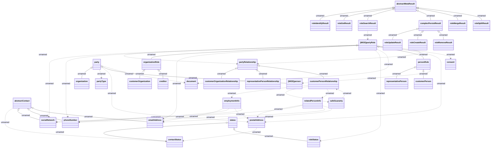

# Party

- **Diagram Type**: Logical
- **Package**: HomerSelect/BSL/Analysis Model/_Interface/Consumed services/PartyWS/Common
- **Diagram ID**: 89259
- **Elements**: 38
- **Connectors**: 53

```mermaid
classDiagram
    class personRole["personRole"]
    class roleRemoveResult["roleRemoveResult"]
    class roleStatus["roleStatus"]
    class MOD_partyRole["{MOD}partyRole"]
    class phoneNumber["phoneNumber"]
    class contactStatus["contactStatus"]
    class roleUpdateResult["roleUpdateResult"]
    class emailAddress["emailAddress"]
    class roleCreateResult["roleCreateResult"]
    class abstractContact["abstractContact"]
    class roleSplitResult["roleSplitResult"]
    class organizationRole["organizationRole"]
    class socialNetwork["socialNetwork"]
    class representativePersonRelationship["representativePersonRelationship"]
    class postalAddress["postalAddress"]
    class employmentInfo["employmentInfo"]
    class relatedPersonInfo["relatedPersonInfo"]
    class MOD_person["{MOD}person"]
    class party["party"]
    class consent["consent"]
    class safeGuaranty["safeGuaranty"]
    class creditor["creditor"]
    class document["document"]
    class roleMergeResult["roleMergeResult"]
    class complexPersistResult["complexPersistResult"]
    class organization["organization"]
    class roleIdentifyResult["roleIdentifyResult"]
    class roleGetResult["roleGetResult"]
    class partyType["partyType"]
    class roleSearchResult["roleSearchResult"]
    class customerOrganizationRelationship["customerOrganizationRelationship"]
    class customerPersonRelationship["customerPersonRelationship"]
    class partyRelationship["partyRelationship"]
    class status["status"]
    class representativePerson["representativePerson"]
    class customerPerson["customerPerson"]
    class customerOrganization["customerOrganization"]
    class abstractMetaResult["abstractMetaResult"]
    party <|-- organization : unnamed
    employmentInfo ..> emailAddress : unnamed
    organizationRole <|-- customerOrganization : unnamed
    MOD_partyRole ..> partyRelationship : unnamed
    safeGuaranty ..> customerPersonRelationship : unnamed
    MOD_partyRole ..> socialNetwork : unnamed
    abstractContact ..> contactStatus : unnamed
    party ..> partyType : unnamed
    roleSearchResult ..> MOD_partyRole : unnamed
    MOD_partyRole ..> phoneNumber : unnamed
    partyRelationship <|-- customerOrganizationRelationship : unnamed
    status <|-- contactStatus : unnamed
    relatedPersonInfo ..> postalAddress : unnamed
    MOD_partyRole <|-- organizationRole : unnamed
    MOD_partyRole ..> emailAddress : unnamed
    abstractMetaResult <|-- roleIdentifyResult : unnamed
    party ..> postalAddress : unnamed
    employmentInfo ..> phoneNumber : unnamed
    partyRelationship <|-- representativePersonRelationship : unnamed
    customerPersonRelationship ..> employmentInfo : unnamed
    MOD_partyRole ..> roleStatus : unnamed
    abstractMetaResult <|-- roleGetResult : unnamed
    party <|-- MOD_person : unnamed
    complexPersistResult <|-- roleUpdateResult : unnamed
    MOD_partyRole ..> document : unnamed
    customerPersonRelationship ..> safeGuaranty : unnamed
    MOD_partyRole <|-- personRole : unnamed
    organizationRole <|-- creditor : unnamed
    status <|-- roleStatus : unnamed
    partyRelationship <|-- customerPersonRelationship : unnamed
    personRole <|-- representativePerson : unnamed
    personRole <|-- customerPerson : unnamed
    abstractMetaResult <|-- roleSearchResult : unnamed
    abstractMetaResult <|-- complexPersistResult : unnamed
    abstractContact <|-- socialNetwork : unnamed
    MOD_partyRole ..> postalAddress : unnamed
    postalAddress ..> contactStatus : unnamed
    employmentInfo ..> postalAddress : unnamed
    relatedPersonInfo ..> socialNetwork : unnamed
    customerPersonRelationship ..> relatedPersonInfo : unnamed
    abstractContact <|-- phoneNumber : unnamed
    complexPersistResult <|-- roleCreateResult : unnamed
    party ..> document : unnamed
    relatedPersonInfo ..> phoneNumber : unnamed
    abstractContact <|-- emailAddress : unnamed
    MOD_partyRole ..> consent : unnamed
    abstractMetaResult <|-- roleMergeResult : unnamed
    MOD_partyRole ..> partyRelationship : unnamed
    relatedPersonInfo ..> emailAddress : unnamed
    complexPersistResult <|-- roleRemoveResult : unnamed
    personRole ..> MOD_person : unnamed
    abstractMetaResult <|-- roleSplitResult : unnamed
    employmentInfo ..> socialNetwork : unnamed
```
