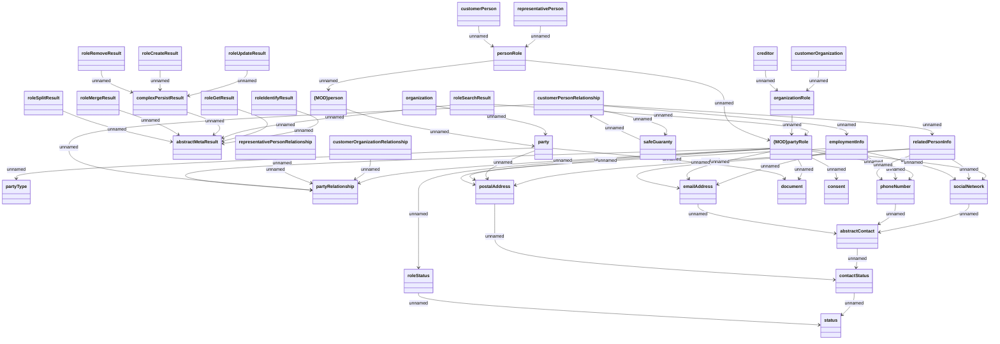

# Party

```mermaid
classDiagram
    class partyType["partyType"]
    class roleSearchResult["roleSearchResult"]
    class customerOrganizationRelationship["customerOrganizationRelationship"]
    class customerPersonRelationship["customerPersonRelationship"]
    class partyRelationship["partyRelationship"]
    class status["status"]
    class representativePerson["representativePerson"]
    class customerPerson["customerPerson"]
    class customerOrganization["customerOrganization"]
    class abstractMetaResult["abstractMetaResult"]
    class roleRemoveResult["roleRemoveResult"]
    class roleStatus["roleStatus"]
    class MOD_partyRole["{MOD}partyRole"]
    class phoneNumber["phoneNumber"]
    class contactStatus["contactStatus"]
    class roleUpdateResult["roleUpdateResult"]
    class emailAddress["emailAddress"]
    class employmentInfo["employmentInfo"]
    class roleCreateResult["roleCreateResult"]
    class personRole["personRole"]
    class roleSplitResult["roleSplitResult"]
    class organizationRole["organizationRole"]
    class socialNetwork["socialNetwork"]
    class representativePersonRelationship["representativePersonRelationship"]
    class MOD_person["{MOD}person"]
    class organization["organization"]
    class complexPersistResult["complexPersistResult"]
    class roleMergeResult["roleMergeResult"]
    class document["document"]
    class creditor["creditor"]
    class roleIdentifyResult["roleIdentifyResult"]
    class safeGuaranty["safeGuaranty"]
    class consent["consent"]
    class party["party"]
    class postalAddress["postalAddress"]
    class relatedPersonInfo["relatedPersonInfo"]
    class roleGetResult["roleGetResult"]
    class abstractContact["abstractContact"]
    organization --> party : unnamed
    employmentInfo --> emailAddress : unnamed
    customerOrganization --> organizationRole : unnamed
    MOD_partyRole --> partyRelationship : unnamed
    safeGuaranty --> customerPersonRelationship : unnamed
    MOD_partyRole --> socialNetwork : unnamed
    abstractContact --> contactStatus : unnamed
    party --> partyType : unnamed
    roleSearchResult --> MOD_partyRole : unnamed
    MOD_partyRole --> phoneNumber : unnamed
    customerOrganizationRelationship --> partyRelationship : unnamed
    contactStatus --> status : unnamed
    relatedPersonInfo --> postalAddress : unnamed
    organizationRole --> MOD_partyRole : unnamed
    MOD_partyRole --> emailAddress : unnamed
    roleIdentifyResult --> abstractMetaResult : unnamed
    party --> postalAddress : unnamed
    employmentInfo --> phoneNumber : unnamed
    representativePersonRelationship --> partyRelationship : unnamed
    customerPersonRelationship --> employmentInfo : unnamed
    MOD_partyRole --> roleStatus : unnamed
    roleGetResult --> abstractMetaResult : unnamed
    MOD_person --> party : unnamed
    roleUpdateResult --> complexPersistResult : unnamed
    MOD_partyRole --> document : unnamed
    customerPersonRelationship --> safeGuaranty : unnamed
    personRole --> MOD_partyRole : unnamed
    creditor --> organizationRole : unnamed
    roleStatus --> status : unnamed
    customerPersonRelationship --> partyRelationship : unnamed
    representativePerson --> personRole : unnamed
    customerPerson --> personRole : unnamed
    roleSearchResult --> abstractMetaResult : unnamed
    complexPersistResult --> abstractMetaResult : unnamed
    socialNetwork --> abstractContact : unnamed
    MOD_partyRole --> postalAddress : unnamed
    postalAddress --> contactStatus : unnamed
    employmentInfo --> postalAddress : unnamed
    relatedPersonInfo --> socialNetwork : unnamed
    customerPersonRelationship --> relatedPersonInfo : unnamed
    phoneNumber --> abstractContact : unnamed
    roleCreateResult --> complexPersistResult : unnamed
    party --> document : unnamed
    relatedPersonInfo --> phoneNumber : unnamed
    emailAddress --> abstractContact : unnamed
    MOD_partyRole --> consent : unnamed
    roleMergeResult --> abstractMetaResult : unnamed
    MOD_partyRole --> partyRelationship : unnamed
    relatedPersonInfo --> emailAddress : unnamed
    roleRemoveResult --> complexPersistResult : unnamed
    personRole --> MOD_person : unnamed
    roleSplitResult --> abstractMetaResult : unnamed
    employmentInfo --> socialNetwork : unnamed
```
